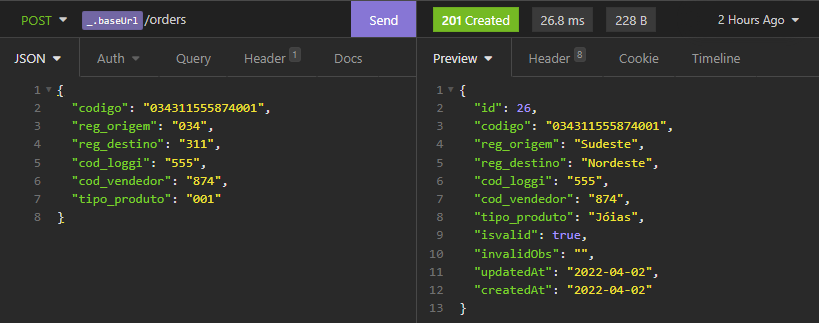
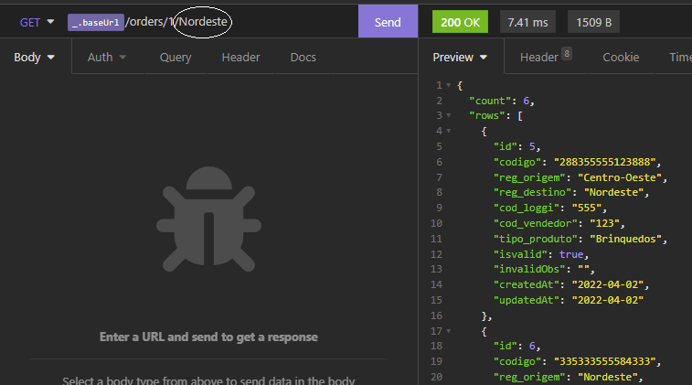
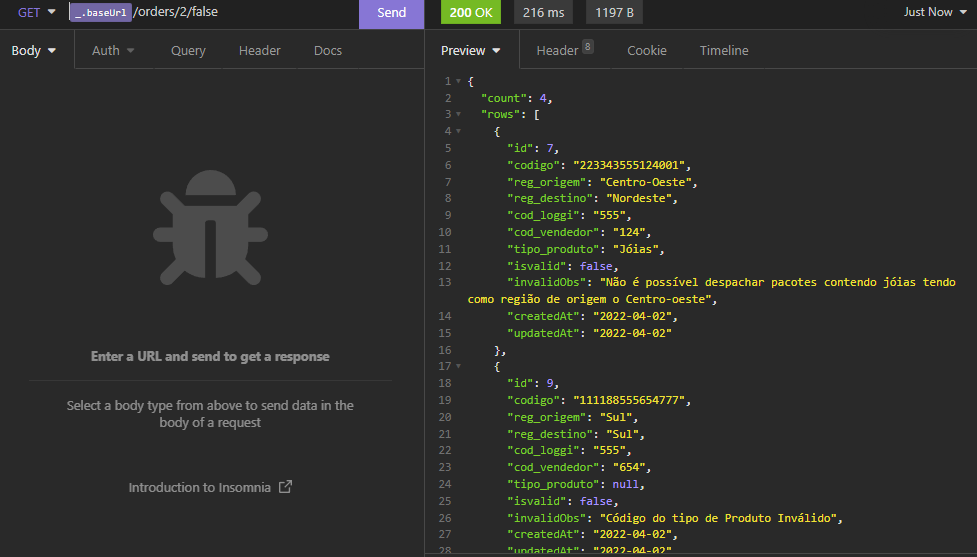
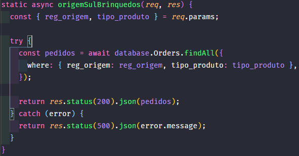
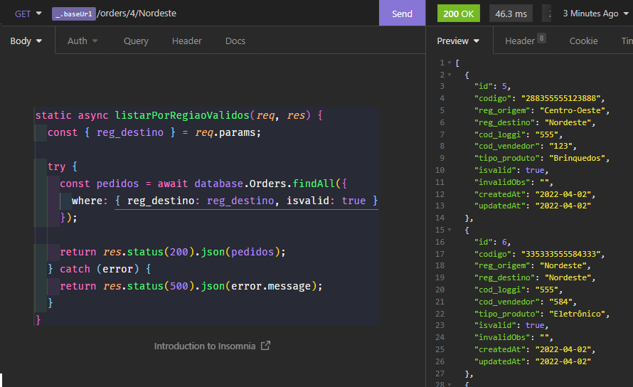
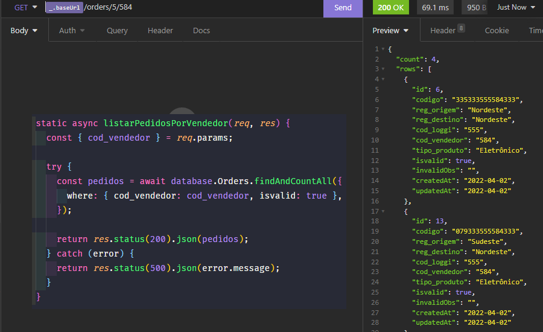

<h1 align="center">
    O leitor de código de barras da Loggi
</h1>

<p align="center">
 <a href="#-sobre-o-projeto">Sobre</a> •
 <a href="#-restricoes">Restricões</a> •
 <a href="#-questoes">Questões</a> •
 <a href="#-como-executar-o-projeto">Como executar</a> • 
 <a href="#-tecnologias">Tecnologias</a>
</p>

## 💻 Sobre o projeto

A Loggi está em constante expansão e precisa da sua ajuda para conectar o Brasil.
O processo de separação de pacotes acontece de modo automático, uma esteira
inteligente lê o código de barras dos pacotes e os agrupa pelas regiões de destino.
O código de barras do pacote é composto por 15 dígitos, onde cada trinca
numérica representa uma informação do pacote.

Projeto Backend e Banco de dados.

### Ordem das Trincas

- 1 Região de Origem
- 2 Região de Destino
- 3 Código da Loggi
- 4 Código do Vendedor do produto
- 5 Tipo do produto

### Código de referência: Cidade/Região

- Centro-oeste 201 até 299
- Nordeste 300 até 399
- Norte 400 até 499
- Sudeste 001 até 099
- Sul 100 até 199

#### Os códigos das cidades estão ordenados por ordem de entrega na rota.

### Tipo do Produto Código

- Jóias 001
- Livros 111
- Eletrônicos 333
- Bebidas 555
- Brinquedos 888

### Exemplo:

- Código: 033 334 555 999 000
- Região de origem: Cidade 33, região Sudeste
- Região de destino: Cidade 334, região Nordeste
- Código Loggi: 555
- Código do vendedor do produto: 999
- Tipo do produto: Jóias

## Restrições

### Considere as seguintes restrições:

1. A Loggi não envia produtos que não sejam dos tipos acima informados.
2. Não é possível despachar pacotes contendo jóias tendo como região de
   origem o Centro-oeste;
3. O vendedor 367 está com seu CNPJ inativo e, portanto, não pode mais
   enviar pacotes pela Loggi, os códigos de barra que estiverem relacionados
   a este vendedor devem ser considerados inválidos.

---

## ⚙️ Questões

### Considerando o Recebimento dos dados do frontend, no qual será enviado um número de 15 caracteres, o mesmo antes do envio será transformado em uma string e dividido em diversas strings como mostrado abaixo:

#### O backend foi feito utilizando NodeJS + Sequelize + Postgres, simulando a utilização de Javascript tanto no BackEnd como no FrontEnd.


### Ao final da inserções no Banco de Dados os dados preenchidos ficaram assim:


#### Fica a critério do usuário o preenchimento do banco de dados manual utilizando o insomnia e os arquivos disponiveis em [dadosDoBc]()

## Exemplo de Request - Post

### O arquivo de testes do insominia pode ser encontrado em [Testes Insomnia]()



#### ou utilizar o comando:

```bash
# Escreva o comando no terminal
npx sequelize db:seed --seed api\seeders\20220402183719-createOrders.js
# Para rodar o Seeder e preencher o banco com os dados.
```

- As colunas de tipo_produto, reg_origem e reg_destino são transformadas em produtos e regiões respectivamente.

### A Loggi precisa:

### 1. Identificar a região de destino de cada pacote, com totalização de

pacotes (soma região);

   

- R: No controller é utilizado como parâmetro a região de destino que o usuário deseja pesquisar, e ela retornará todos os códigos daquela região juntamente com aqueles válidos ou não

### 2. Saber quais pacotes possuem códigos de barras válidos e/ou inválidos;

   

- R: Todos os códigos que possuem 15 caracteres automaticamentes são criados e depois checados suas informações, se o código for inválido, o mesmo recebe o atributo isvalid como false e no atributo invalidObs o motivo daquele código estar inválido, no controller podemos utilizar o atributo isvalid como atributo de rota e passa-ló como false para obtermos todos os pedidos inválidos

### 3. Identificar os pacotes que têm como origem a região Sul e Brinquedos em seu conteúdo;

 

- R: Utilizando a origem do produto e o tipo por parâmetro de rota podemos utilizar o método findAll e where para filtrar a pesquisa dos pacotes por origem e tipo de produto, assim chegando a conclusão que nem nenhum pedido atende a essas exigências.

### 4. Listar os pacotes agrupados por região de destino (Considere apenas pacotes válidos);

 

- R: Utilizaremos o reg_destino como parâmetro de rota para pegar todas os códigos com destino ao Nordeste, posteriormente passaremos o atributo isvalid como true, para retornar apenas os códigos válidos.

### 5. Listar o número de pacotes enviados por cada vendedor (Considere apenas pacotes válidos);

 

- R: Assim como na questão 4, aqui utilizaremos o cod_vendedor como parâmetro de rota para pegar todas os códigos relacionados a esse vendedor, posteriormente passaremos o atributo isvalid como true, para retornar apenas os códigos válidos.

---

## 🚀 Como executar o projeto

### Pré-requisitos

Antes de começar, você vai precisar ter instalado em sua máquina as seguintes ferramentas:
[Git](https://git-scm.com), [Node.js](https://nodejs.org/en/), [Docker](https://www.docker.com).

Além de um editor de código como o [VSCode](https://code.visualstudio.com/).

Para visualização do banco de dados recomendo a utilização do [DBeaver](https://dbeaver.io/download/).

#### 🎲 Rodando o Backend (servidor)

> Configure o DBeaver de acordo com o arquivo [config.json](https://github.com/RenatoAlbuquerque/Aplicacao_shortURL/blob/main/BackEnd/api/config/config.json)

```bash
# Clone este repositório
$ git@github.com:RenatoAlbuquerque/Desafio_Loggi_Engenharia.git
# Crie um container no Docker com o comando abaixo
$ docker run --name postgres -e POSTGRES_PASSWORD=postgres -p 5432:5432 -d postgres
# Verifique se o container esta em execução
$ docker ps
# Acesse a pasta do projeto no terminal/cmd
$ cd Desafio_Loggi_Engenharia
# Instale as dependências
$ npm install
# Execute a aplicação
$ npm start
# O servidor iniciará na porta:3333 - acesse http://localhost:3333
# O banco de dados utilizara a porta:5432
```

---

## 🛠 Tecnologias

#### [](https://github.com/tgmarinho/Ecoleta#server-nodejs--typescript)**Server** ([NodeJS](https://nodejs.org/en/) + [Sequelize](https://sequelize.org/v6/))

- **[Body-parser](https://www.npmjs.com/package/body-parser)**
- **[CORS](https://expressjs.com/en/resources/middleware/cors.html)**
- **[Express](https://expressjs.com/)**
- **[Nodemon](https://www.npmjs.com/package/nodemon)**
- **[Path](https://www.npmjs.com/package/path)**
- **[Pg](https://www.npmjs.com/package/pg)**

> Veja o arquivo [package.json](https://github.com/RenatoAlbuquerque/Aplicacao_shortURL/blob/main/BackEnd/package.json)

**Utilitários**

- Teste de API: **[Insomnia](https://insomnia.rest/)**
